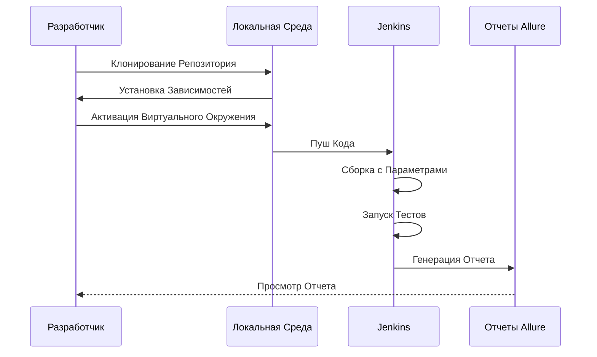

# Центр Финансовых Технологий

---

Этот проект содержит автоматизированные тесты для веб-сайта [Центр Финансовых Технологий](https://www.cft.ru/).

## Описание

Проект включает в себя набор автоматизированных тестов, написанных с использованием фреймворков Selene и Allure. Тесты
проверяют функциональность сайта, включая переключение между вкладками, добавление товаров в корзину и загрузку файлов.

---

## Используемые инструменты

<p align="center">
  
  
  
  
  
  
  
</p>

**Selene** - это обертка над Selenium, облегчающая написание тестов и взаимодействие с веб‑элементами.

**Allure** - это инструмент для создания красочных отчетов о тестировании с поддержкой различных языков программирования.

**Pytest** - это фреймворк для написания и запуска тестов. Он предоставляет удобный синтаксис и разнообразные возможности для тестирования.

---

## Содержание

<details>
<summary>Установка</summary>

### Клонирование репозитория
   
Для начала работы, клонируйте репозиторий и перейдите в директорию проекта:
   ```sh
    git clone https://github.com/yarskii/cft_tests.git
    cd cft_tests
   ```
### Создание виртуального окружения (опционально)
   ```sh
    python -m venv venv
    source venv/bin/activate  # Для Linux/macOS
    .\venv\Scripts\activate   # Для Windows
   ```
### Установка зависимостей

Создайте файл `requirements.txt`, содержащий список всех зависимостей проекта:
   ```sh
    pip freeze > requirements.txt
   ```
Затем установите зависимости:
   ```sh
    pip install -r requirements.txt
   ```
Если у вас уже есть файл `requirements.txt`, просто выполните команду:
   ```sh
    pip install -r requirements.txt
   ```

</details>

<details>
<summary>Запуск тестов</summary>

### Локальный запуск

Чтобы запустить все тесты, выполните команду:
   ```sh
    pytest
   ```
Для запуска конкретного теста, используйте следующую команду:
   ```sh
    pytest tests/test_switch_page_catalog.py
   ```
### Параметры запуска

Вы можете использовать различные параметры для управления поведением тестов:

- `-s`: Выводить все выводы в консоль.
- `-v`: Детализированное логирование.
- `--alluredir=allure-results`: Сохранять результаты тестов для генерации отчетов Allure.

Пример команды:
   ```sh
    pytest --alluredir=allure-results
   ```
</details>


<details>
<summary>Генерация отчетов Allure</summary>

### Установка Allure Commandline

Следуйте инструкциям на официальном сайте [Allure](https://docs.qameta.io/allure/#_installing_a_commandline) для
установки Allure Commandline.

### Генерация отчета

После выполнения тестов с параметром `--alluredir`, вы можете сгенерировать отчет следующей командой:
   ```sh
    allure serve allure-results
   ```
</details>

<details>
<summary>Запуск проекта в Jenkins</summary>

1. Откройте [проект](https://jenkins.autotests.cloud/job/tests_cft/)
2. Выберите `Build with parameters`
3. Измените параметры, если требуется:
   - Укажите комментарий
   - Выберите вариант теста
   - Выберите версию браузера
4. Нажмите `Build`
5. После сборки, результат работы можно увидеть в `Allure Report`

> **Доступные параметры**:
> - Варианты тестов: `tests`, `tests/tests_switch_pages`, `tests/tests_search_information`
> - Версия браузера: `99`, `100`, `113`, `114`, `120`, `121`, `122`, `123`, `124`, `125`, `126`
---
</details>

## Диаграммы

### Последовательность действий при запуске тестов


---

## Скриншоты

### Cтраница тестов Jenkins

   <p>
      
   </p>

### Общий отчёт Allure

   <p>
      
   </p>

### Детальный отчёт о пройденном тесте

   <p>
      
   </p>

### Видео-отчет о прохождении теста
   
   <p>
      
   </p>

### Отчет в Telegram

   <p>
      
   </p>

---

## Лицензия

Этот проект лицензирован под MIT License. Подробности смотрите в файле [LICENSE](LICENSE).

---

Если у вас есть вопросы или предложения, пожалуйста, создайте issue на GitHub или свяжитесь со мной напрямую.

Автор: Ярослав Гусев